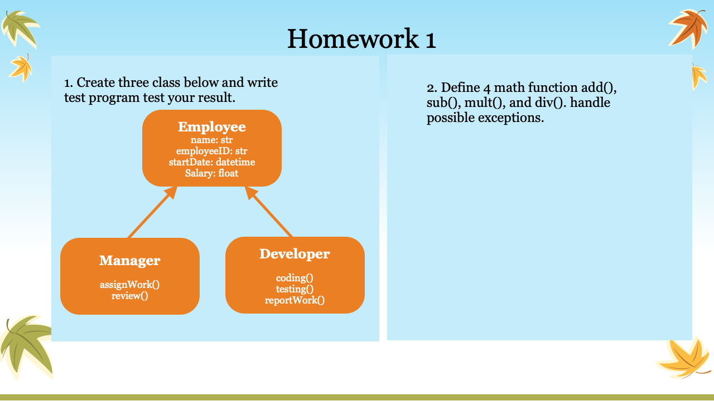

## Student
niuruibryan@gmail.com
klwang2000@yahoo.com
Django REST with Reqct

[DJango Rest](https://www.valentinog.com/blog/drf/)

[DJango with Firebase](https://medium.com/@canadiyaman/how-to-use-firebase-with-django-project-34578516bafe)

https://www.valentinog.com/blog/drf/

## 20200619 讲义
* Check Homework
* Review last class
    - relationship between player-dealer; card-blackjackcard; dealer-deck;
* implement your own dunder.range1() function start from 1 inclusive
    _ Card __gt__, __lt__
    - range1(5) > 1, 2, 3, 4, 5
    - range1.py
* 

---
## 20200613 讲义

* Black Jack Part 4
    - DealerTest.py
    - card.py (Dealer)
* Black Jack Part 5
    - card.playGame()
* compare with blackjack.py

---
## 20200612 讲义
* Check Homework
    - Unit test issue?
    - check __eq__
    - unit test for card
* Review last class
    - Black Jack Part 1
    - share my test_card.py, modify card code to meet the unit tests.
* Black Jack Part 2
    - modify card.py constructor take care wrong input
    - complete class Deck (python2-0430.git)
    - search around shuffle python list (shuffle.py)
* Black Jack Part 3 
    - Player.py
    - PlayerTest.py

---
## 20200606 讲义
* Check homework
    1. math support
    2. fixed unit test

* passing function instead of variable 
    - func0.py
    - func.py
    - func1.py

* return function instead of variable
    - func2.py

* Functional Programming
* Object Oriented Programming
    - Black Jack Part 1
    - card.py
    - CardTestOne.py

## 20200605 Friday
### Check homework
1. try-except block
2. unit test
3. support tuple and list, better complex

### Logging
```py
>>> import logging
>>> help(logging)
```
playground>logging1.py

use logging in your existing code

### Black Jack Card

playground>card.py

## 20200530
### Check homework
1. Employee, Manager, Developer class and test class
2. add(),sub(),mul(),div() function and exception handling.

### super().__init__()
refer to: student2.py; oopTest.py(7-9)


### Virtual Environment
```
python -m venv env
env/script/activate.bat
```

### try-except Block
circleTest.py (application terminated)

try-catchTest.py (add try-except block, make code non-stop)
try-catchTest1.py (optimize code)

>Right-click > Command Palette > "Configure Tests" > unittest > .Root Directory > test_*.py

test_circleArea.py (unit test)

### Logging
```py
>>> import logging
>>> help(logging)
```
logging1.py

### Lambda Expression
lambda.py

refer to: lambda1.py

## 20200529

Check homework
1. Student class
2. circle area function

Talking about difference between class and function

### Class
* Design of object, used to create object (OOP)
* 1-class name; 2-attributes; 3-functions
* Encapsulation; Abstraction; Inheritance; Polymorphism

1. Abstraction
2. Inheritance (person.py, student2.py, teaher.py, oopTest.py)
3. Encapsulation (run __init__; oopTest.py)
4. Polymorphism (oopTest.py)

Question:
Does your student class can do everything student can do?

### Function
circle.py
circleTest.py
raise exception (circle1.py)
## Homework
