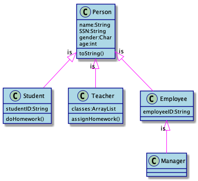
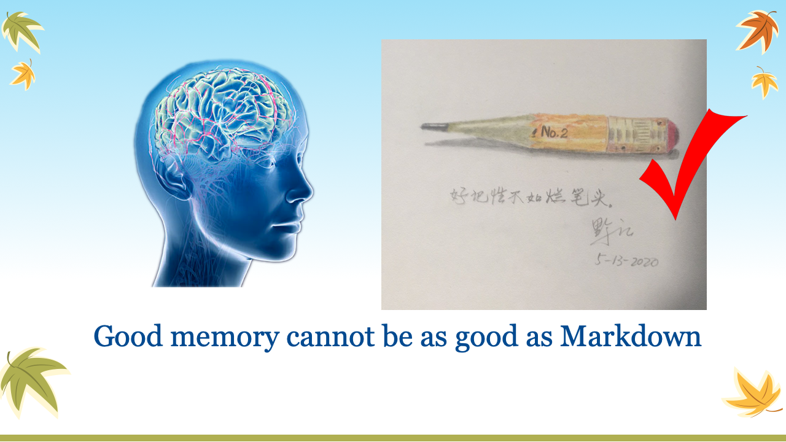

# 华夏中文学校2020-07-06 Java 暑期班 level2 9:00-11:00AM

wfkuang@yahoo.com;
td6606@hotmail.com;
## 2020-07-29
* Data Structure
    - StackTest.java
    - QueueTest.java

## 2020-07-28
* Card Game (Continue)
    - BlackJackPart2.md
    - equals() > Overloading & Overriding
 
## 2020-07-27
* Sort
    - SortTest.java

* Card Game
    - BlackJackPart1.md
    - Card.java
    - BlackJackCard.java  
    - CardTest.java

## 2020-07-23
* JSON
    - [Download org.json jar](https://jar-download.com/artifacts/org.json)
    - JsonFileTest.java
    
---
## 2020-07-22
* Exception (continue)
    - [Practice]: Math1.java > circleArea()
    - ExceptionTest.java
* File Access
    - FileTest.java
    - [Practice] ArrayListTest.java > writeObjectArrayToFile()
---
## 2020-07-21
* Method parameters
* Method Overloading
    - Math1.java > add(float f): add(int i)
    - > add(double d)
    - [Practice]:
* Java Scope
    - 
    - Person.java > Student.java > Teacher.java
    - Modifiers: public, protected, private
    - new package, call Math1.java> add()
---
## 2020-07-20
* how to do Homework
* Review ArrayList
    - ArrayListTest.java > createObjectArray() >
---
## 2020-07-16
* ArrayList
    - ArrayListTest.java
    - [Practice]: create an ArrayList hold 52 cards.
* Define Method
    - [Practice]: Math1.java > calculate circleArea()

---
## 2020-07-15
* GuessNumber.java
    - random
    - [Practice]: modify code, automatically terminated game after 3 runs.
    - [Practice]: Modify code, create a new method named play().
* Switch
    - SwitchTest.java

* Array
    - ArrayTester.java
    - [Practice]: create an array of double, calculate the sum.
    - [Practice]: create an array of card faces and card suits, build 52 card as array.
    {0, 0, 0, 0}
    {10, 12, 15, 16}

---
## 2020-07-14
* For Loop
    - LearnForLoop.java
    ```java
    for (int k = 5; k>i; k--) {
        System.out.print(" ");
    }   
    ```
    - modify main() method modifier

* If-Else
    - IfElseTest.java
    - [Practice]: simple if only statement, print out odd number 0-20
    ```data
    1, 3, 5, 7, 9, 11, 13, 15, 17, 19
    ``` 
* For Loop
    - ForLoopTest.rollDices()
* While loop
    - whileLoopTester.java
    - doWhileTest()
    - breakOnCondition()
    - continueOnCondition()
    - dice()

---
## 2020-07-13
* check homework
    - Alyssa
* For Loop
    - ForLoopTester.java
    - [Practice]:
        ```output
        We're on time 0
        We're on time 1
        We're on time 2
        ```
* Operators
    - OperatorTest.java
    

---
## 2020-07-09
* OOP Concept
    - [Practice]: create Math1.java class with add, sub, mul, div methods
try to change the format
try to remove keyword "public static void main(String[] args){}" best way to learn is make change of code.
try to create variable without data type

* System.out.println()
    - Print.java > basicPring()

* Data Type
    - DataTypeTest.java

* For Loop
    - ForLoopTester.java
    - [Practice]:
        ```output
        We're on time 0
        We're on time 1
        We're on time 2
        ```
* If-Else
    -   IfElseTest.java
    
---
## 2020-07-08
* OOP Concept (Why Java always start from class)
    - Pencil.java > Constructor > toString() > take notes > draw image
    - more keywords: this, double, new > constructor
    - [Practice]: create their own class with Constructor, toString, and more
    - method signature, finger print, overloading
    - Generating constructor, toString, getter/setter
    - [Practice]: create Math1.java class with add, sub, mul, div methods

* Java Language Keywords
    

* Scanner    
```java
    Scanner scanner = new Scanner(System.in);
    String name = scanner.nextLine();
    System.out.println("Hello," + name);
    scanner.close();
```

* JDK API Document
    - [JDK API DOC](https://docs.oracle.com/javase/8/docs/api/)

* System.out.println()
    - Print.java

* Data Type
    - DataTypeTest.java

---
## 2020-07-07

* turn in homework to GitHub
    - 
* Markdown md文件的制作，制作课堂笔记

* 显示标题，子标题 #, ##
* 显示 tablet *，1
* 显示命令行

* Familiar with your keyboard


space
:
ctrl+c
Ctrl+v
ctrl+/
shift+downarrow
tab
shift+tab
Enter(Return)
"
`
---
* Start student own project, try yourself there
    - New > Java project: <student name> > new package: com.huaxia.test
    - Hello.java
    - HelloByName.java

* System.out.println()
```java
	public static void main(String[] args) {
		System.out.println("Hello, World!");

	}
```

* OOP Concept (Why Java always start from class)
    - 
    -  
    - [Practice]: create any class (constructor, toString())
    - 

---
## 2020-07-06
* Famillar with your keyboard


* Check for java installation
open DOS window
```
java -version
javac -version
```

* 软件下载安装
>Google search: eclipse for java
Search result: Eclipse Downloads | The Eclipse Foundation

>Google search: jdk 8 download
Search result: Java SE Development Kit 8 - Downloads - Oracle
1. [Java Compiler Download](https://www.oracle.com/java/technologies/javase-downloads.html)

>File: jdk-14.0.1_osx-x64_bin.dmg
[Google Drive](https://drive.google.com/file/d/1jEbRJlInNtxdNAtxFVhAgoOSQph42X3S/view?usp=sharing)

2. [Eclipse Download](https://www.eclipse.org/downloads/)

>File: eclipse-inst-mac64.dmg
[Google Drive](https://drive.google.com/file/d/13NQm6zd0tzSdU98HGNiYrPHOUh4IcKCx/view?usp=sharing)

>Google search: git downloads
Search result: Git - Downloads 
3. [Git Download](https://git-scm.com/downloads)
[Google Drive](https://drive.google.com/file/d/1o9Xu_q23XQco3jRMaKk45AQWtGW1Md-R/view?usp=sharing)

MacOS do the following:
```
brew install git
ls -la /usr/local 
sudo chown -R wangqianjiang:wheel /usr/local
brew link git
```

Check installation:
```
javac -version
git --version
```
* open Eclipse
getting formillar with Eclipse IDE
Open File explore>create a workspace\
```
mkdir workspace
cd workspace
git clone https://github.com/jwang1122/java.git
```
Run Eclipse icon > close Welcome window > File > new project > java project > huaxia > next 
> Project name: huaxia > [Finish] > Open Perspective
explain little bit about perspective > close Task List window
(Window > show view > navigator)
click project name > click package icon > com.huaxia.package1
click class icon > Name: First > check main() > [finish]

```java
package com.huaxia.package1;

public class First {

	public static void main(String[] args) {
		System.out.println("Hello, World!");

	}
}
```
* Markdown md文件的制作，制作课堂笔记

* 显示标题，子标题 #, ##
* 显示 tablet *，1
* 显示命令行


space
:
ctrl+c
tab
Enter(Return)
"
```
```

---

## 老生报名单
总校 （老生）
* Alyssa Kuang（旷章颖-女）
* jingyuan Fan（范景元）
糖城

## 新生报名
* 