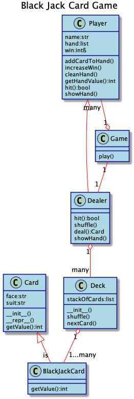

# 华夏中文学校2020-05-29 Python 暑期班 level2 （01:30-03:30pm）
[Python Interface](https://realpython.com/python-interface/)

[__init__.py python package](https://docs.python.org/3/tutorial/modules.html)

* command line arguments
    - get commandline arguments
    - define commandline arguments in __init__.py
```py
def fib(n):    # write Fibonacci series up to n
    a, b = 0, 1
    while a < n:
        print(a, end=' ')
        a, b = b, a+b
    print()

if __name__ == "__main__":
    import sys
    fib(int(sys.argv[1]))
```
## 2020-07-23
---
## 2020-07-22
---
## 2020-07-21
* Card Game Continue
    - area.py
    - area1.py
    - card3.py
* switch
    - switch.py
    - function as dict value (switcher.py)
    - variableArgs.py
* pass function to a function as argument
    - func1.py
* return a function from a function
    - func2.py
* timer decorator
    - uderstand pass/return function function/func1.py
    - my_timer1.py understand wrapper function
    - my_timer2.py

* Functional Programming

* lambda expression
    - defineFunction.py
    - func.py
    - lambda.py (anonymous function)
    
    - >>> dir(__builtins__) > map, filter, reduce (no loop)
    - >>> help(map) > map(function, iterable, ...)
    - >>> help(filter)
    - map(function, iterable, ...)
    - map0.py, map1.py, map2.py, map3.py
    - filter0.py, filter1.py
    - reduce.py (functools.reduce())
    - sort1.py (sorted())
    - sort2.py (list.sort())
    - either
        * either0.py
        * either1.py
        * either2.py
    - monad.py (understand Just() box)
---
## 2020-07-20
* Card game continue
    - class Game
    - get rid of if-else
    - decision table

---
## 2020-07-16
* Black Jack Card (Continue)
    - check error on Grace machine
    - card.py > playGame()
    - Optimize the code > class Game:
    - Game.check4win()
    - [Homework]: write unit test for check4Win() and dealCards()
    - homework > modify code support multi player
    - [Practice]: add bit to players

* assert

    - [Practice]: write program using keywords we have learned.
    - assert0.py
    - assert1.py
    - assert2.py

* passing function instead of variable 
    - [Practice]: define average function (assert1.py)
    - func0.py
    - func.py
    - func1.py

* return function instead of variable
    - func2.py
---
## 2020-07-15
* Black Jack Card Game(continue)
    - Dealer > deal(), showHand()
    - DealerTest.py
    - def playGame():
---
## 2020-07-14
    - class Dealer(Player): __init__(), shuffle(), hit(), showHand()
    - unittest test_dealer.py

---
## 2020-07-13

    - class Deck: > __init__(), nextCard(), shuffle()
    - unittest test_deck.py
    - class Player: > __init__(), __repr__(), addCardToHand(), cleanHand(), getHandValue(), getHandSize(), hit()
    - unittest test_player.py

---
# 2020-07-09

    - card.py > class Card (__init__(), __repr__())
    - class Card:
    - class BlackJackCard:
    - unittest test_card.py

---
# 2020-07-08
* Unit test
    - [Practice]: crete unit test for simple math add, sub, mul, div (tuple + int, tuple + tuple, list + list)

* Logging
    - logging1.py
    - [Practice]: add logging in simple math add, sub, mul, div

* OOP programing concept
    - 

    - 
    - [Practice]: student.py
    - load csv, build student objects
    - [Practice]: look around, find anything catch your eye, create a class of it

* Inheritence
    - super class (person.py)
    - sub class (employee, manager)
    
## 2020-07-07

* try-except function
    - python > dir(__builtins__) > TypeError > ValueError
    - try-exceptTest2.py
    - [Practice]: implement math function add, sub, mul, div

* Unit test
    - Command Pallete > Python: Configure Tests > unittest > . Root directory > test_*.py
    - Command Pallete > Python: Discover Tests 
    - test_circleArea.py
    - [Practice]: crete unit test for simple math add, sub, mul, div (tuple + int, tuple + tuple, list + list)

* Logging
    - logging1.py
    - [Practice]: add logging in simple math add, sub, mul, div

```py
>>> import logging
>>> help(logging)
```

## 2020-07-06
* CRUD huaxia book
```
cd workspace
git clone https://github.com/eagleboatblue/reactjs.git
cd reactjs
cd book-app
npm install
cd ../server
python -m venv env
.\env\Scripts\activate.bat
mongod
python app.py
cd ../book-app
npm start
```

* raise Exception
    - circle.py
```py
from math import pi

def circle_area(r):
    return pi * (r**2)
```
test code with -2, 3+4j, "hello"
raise Exception
    - circle1.py
```py
    if type(r) not in [int, float]:
        raise TypeError("The radius must be a real number.")
    if r < 0:
        raise ValueError("The radius cannot be negative.") 
```
do different test, show program terminated in the middle
    - try-except/circleTest.py

* try-except Block
    - try-exceptTest.py
    - circleTest2.py
    - try-catchTest.py (add try-except block, make code non-stop)
    - try-catchTest1.py (optimize code)
 

[Hi-Low Card Game](https://stevepython.wordpress.com/2018/11/09/python-gui-card-game/)

老生
总校
* Daniel Duan（段以理）
* Yichen Wang（王依晨-女）
* Grace Yang （女）
* Mathew Kan （耿大正）
* Jiajun Tang （唐家骏）
糖城
* Eric Wang （王知行）
* Austin Song（宋宇恒）