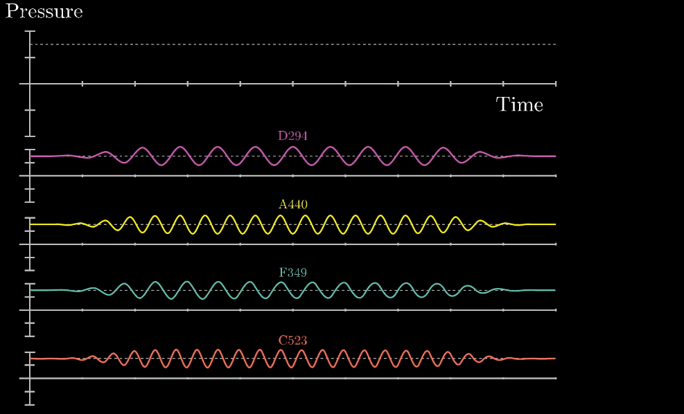

# Fourier Transformation

## Euler's Formular (God Equation)

$e^{i \pi} + 1 = 0$

$e^{i \pi} = cos(\pi) + i\ sin(\pi) = -1$


## Taylor series

$$e^x = \sum_{n=0}^{\infty}\frac{x^n}{n!}$$

$$e^x = cos(x) + i\ sin(x)$$

$$e^{i \theta} = cos(\theta) + i\ sin(\theta)$$

$$e^x = \sum_{n=0}^{\infty}\frac{x^{n}}{n!}=1+x+\frac {x^{2}}{2!}+\frac {x^{3}}{3!}+\cdots +\frac {x^{n}}{n!}+\cdots $$

## Fourier Transform

$$f(\xi) = \int_{-\infty}^{\infty} f(x) e^{-2\pi i x \xi} dx $$


## 声音的波形分析
那么如果给你随意一段随时间变化的气压曲线，你如何找到这些原有的组成音符呢？这就是我们的目的



```Greek letters
α \alpha κ \kappa ψ \psi z \digamma ∆ \Delta Θ \Theta
β \beta λ \lambda ρ \rho ε \varepsilon Γ \Gamma Υ \Upsilon
χ \chi µ \mu σ \sigma κ \varkappa Λ \Lambda Ξ \Xi
δ \delta ν \nu τ \tau ϕ \varphi Ω \Omega
 \epsilon o o θ \theta $ \varpi Φ \Phi ℵ \aleph
η \eta ω \omega υ \upsilon % \varrho Π \Pi i \beth
γ \gamma φ \phi ξ \xi ς \varsigma Ψ \Psi k \daleth
ι \iota π \pi ζ \zeta ϑ \vartheta Σ \Sigma ג\ gimel
```