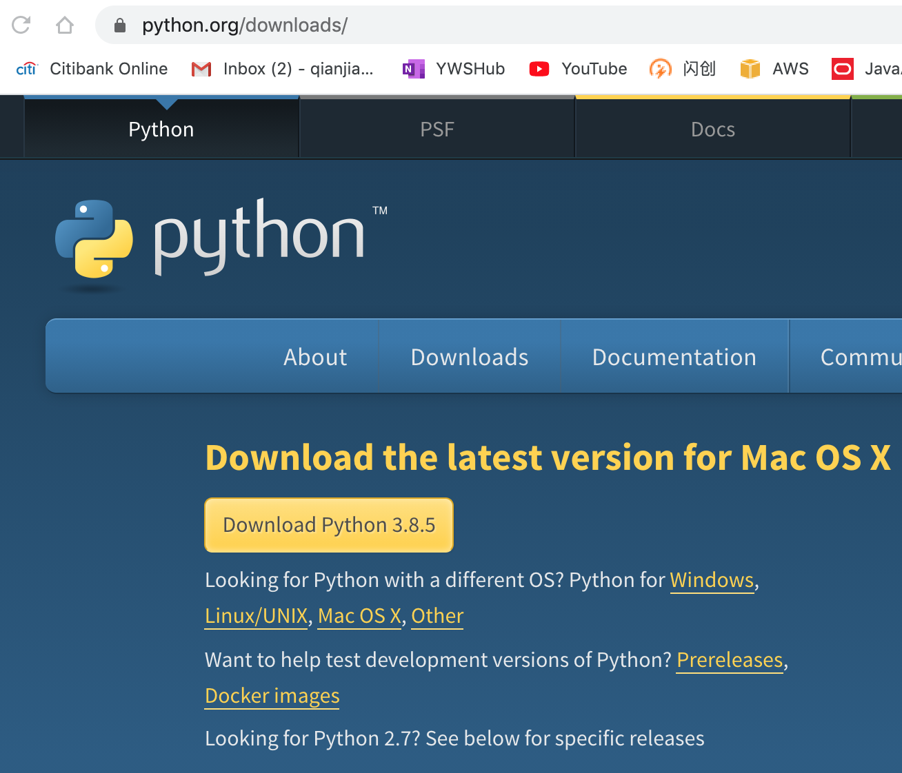
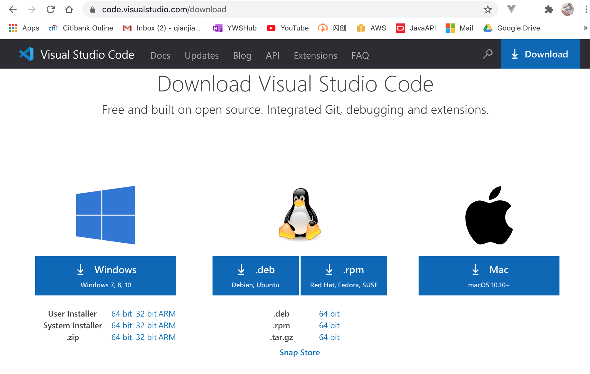
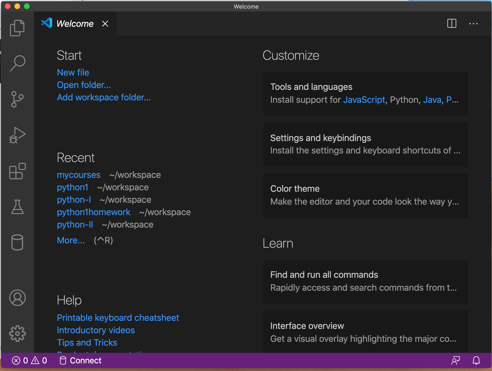
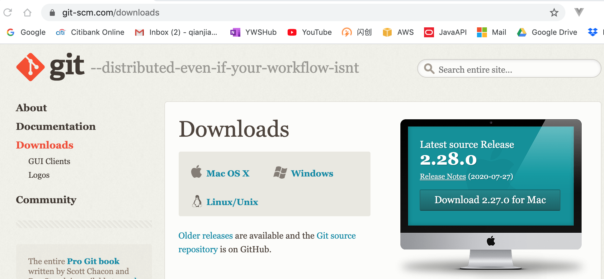
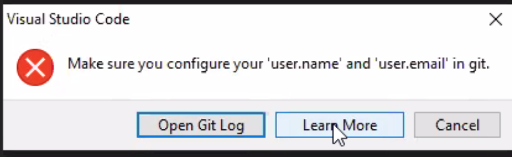

# Python Class Installation Process

## Install Pythton Interpreter
* Google Search: python downloads
* [Download Website](https://www.python.org/downloads/)

* Downloaded File: python-3.8.5-macosx10.9.pkg
* Double click to install
* Check for success of Python installation
Open Terminal window, type in

```
python3 --version
```


## Install Visual Studio Code
* Google Search: vscode download
* [Download Website](https://code.visualstudio.com/download)

* Downloaded File: VSCode-darwin-stable.zip
Unzip the file, copy to /Applications folder
* Check the installation success


## Install Git
* Google Search: git download
* [Download Website](https://git-scm.com/downloads)

* Downloaded FIle: 


